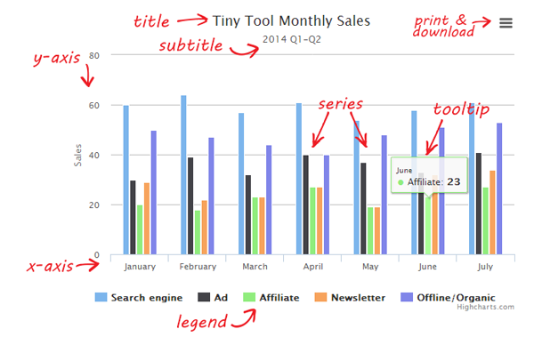

# 关于 Highcharts 的 100 个常见问题

为了方便大家阅读，这里简单用一张图来说明图表中各个部分的组成及名词解释。



### 名词解释

  名词             | 解释  
  -------------   | -------------         
  title, subtile  | 标题，副标题            
  print, download | 打印，下载，这里统称导出
  xAxis, yAxis    | 坐标轴，包含 x 轴和 y 轴
  credits         | 版权信息，水印          
  series          | 数据列                 
  tooltip         | 数据提示框              
  legend          | 图例                  


## Q1：如何去掉水印（即图表中 highcharts.com 字样）

A：通过设置  credits.enabled = false 即可

```
$('#container').highcharts({
    // ...
    credits: {
      enabled: false
    },
    // ...
})
```

## Q2：如何增加导出功能（或显示导出按钮）？

A：只需要引入 exporting.js 即可给图表加上导出功能

```
<script src="http://cdn.hcharts.cn/highcharts/modules/exporting.js"></script>
```

同样的，如果你不需要导出功能，不引入这个文件即可；另外，还可以在引入这个文件的情况下，通过配置  exporting.enabled = false 来禁用导出功能。

```
$('#container').highcharts({
  // ...
  exporting: {
    enabled: false
  },
  // ...
});
```

## Q3：如果去掉（或不显示）图例（Legend）？

A：通过设置 legend.enabled = false 即可不显示图例，即

```
$('#container').highcharts({
  // ...
  legend: {
    enabled: false
  },
  // ...
})
```

### 相关扩展

在饼图中默认是不显示图例的，可以通过 plotOptions.pie.showInLegend = true 来显示

## Q4：如果阻止点击图例隐藏曲线？

```
plotOptions: {
    series: {
        events: {
            legendItemClick: function(event) {
                return false;
                //return false 即可禁用LegendIteml，防止通过点击item显示隐藏系列
            }
        }
    }
}
```

论坛帖子：http://bbs.hcharts.cn/thread-1170-1-1.html

### Q5：图表中时间为什么少了 8 小时？

时区问题，中国的时区是 +8 区，通过配置如下代码即可解决这个问题

```
Highcharts.setOption({
  global: {
    timezoneOffset: -8 * 60
  }
});
```

论坛帖子：http://bbs.hcharts.cn/thread-1173-1-1.html

### Q6： 如何设置图表颜色？

1）最基本的图表线条（或柱形等），是通过 colors 来设置的，即

```
$('#container').highcharts({
  // ...
  colors: ['#7cb5ec', '#434348', '#90ed7d', '#f7a35c', '#8085e9','#f15c80', '#e4d354', '#8085e8', '#8d4653', '#91e8e1']
  // ..
})
```
其中颜色值及个数完全可以自定义

2）定义某个点的颜色

通过设置 series.data.color 实现对某个点进行自定义颜色，实例效果如下


3）对于柱状图单个序列颜色的自定义，除了设置 colors外，还需要额外设置  plotOptions.column.colorByPoint = true ，其他类型图表类似的也有


参考帖子：http://bbs.hcharts.cn/thread-491-1-2.html

## Q7：如何将图表中的英文汉化（显示成中文）？


请查看帖子：http://bbs.hcharts.cn/thread-70-1-1.html

即设置 lang 属性，改属于用于图表中文字的显示，也就是说，图表中所有文字的修改都可以通过该属性下来设置。


 实例代码：

```
Highcharts.setOptions({
    lang: {
        contextButtonTitle: "图表导出菜单",
        decimalPoint: ".",
        downloadJPEG: "下载JPEG图片",
        downloadPDF: "下载PDF文件",
        downloadPNG: "下载PNG文件",
        downloadSVG: "下载SVG文件",
        drillUpText: "返回 {series.name}",
        loading: "加载中",
        months: ["一月", "二月", "三月", "四月", "五月", "六月", "七月", "八月", "九月", "十月", "十一月", "十二月"],
        noData: "没有数据",
        numericSymbols: ["千", "兆", "G", "T", "P", "E"],
        printChart: "打印图表",
        resetZoom: "恢复缩放",
        resetZoomTitle: "恢复图表",
        shortMonths: ["Jan", "Feb", "Mar", "Apr", "May", "Jun", "Jul", "Aug", "Sep", "Oct", "Nov", "Dec"].,
        thousandsSep: ",",
        weekdays: ["星期一", "星期二", "星期三", "星期三", "星期四", "星期五", "星期六", "星期天"].
    }
});


$("#container").highcharts({
    // Highcharts 代码
});
```

 注意：Highcharts.setOptions({}) 属于全局配置，代码是放在  $("#container").highcharts({}) 外面。

## Q8：如何去掉图例单击事件？

即如何使点击图例（Legend）不隐藏对应的序列（Series），设置代码是：
```
plotOptions: {
    series: {
       events: {
          legendItemClick: function(event) {
             return false;  //return false 即可禁用LegendIteml，防止通过点击item显示隐藏系列
          }
      }
   }
}
```
参考实例：http://www.hcharts.cn/demo/index.php?p=92

对于饼图的图例事件是在  point.events.legendItemClick 里
